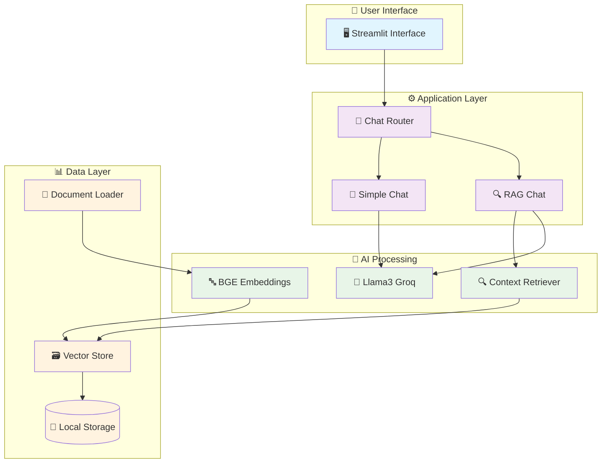

# 🚀 RAG-Powered Chat Assistant

<div align="center">


**A professional Streamlit chat assistant powered by Retrieval-Augmented Generation (RAG) and Groq's Llama3 model**

*Transform your documents into intelligent conversations*

[🎯 Features](#-features) • [🚀 Quick Start](#-quick-start) • [🏗️ Architecture](#️-architecture)

</div>

---

## 📊 Project Overview

This chat assistant combines Large Language Models with Retrieval-Augmented Generation to provide contextually aware responses. Choose between simple LLM interactions or document-powered conversations.

## 🎯 Features

- 💬 **Simple LLM Chat**: Direct communication with Llama3 via Groq API
- 🔍 **RAG-Enhanced Chat**: Document-aware conversations with context retrieval
- 📄 **Multi-format Support**: PDF, TXT, DOCX document processing
- 💾 **Session History**: Persistent chat conversations
- ⚡ **Fast Processing**: High-performance with Groq infrastructure
- 🎨 **Modern UI**: Clean Streamlit interface

---

## 🏗️ Project Structure

```
RAG-Powered-Chat-Assistant/
│
├── 💬 llm_chat.py              # Simple LLM chat
├── 🔍 rag_chat.py              # RAG-enhanced chat
├── 📋 requirements.txt         # Dependencies
├── 🔧 .env                     # Environment variables
│
├── 📁 data/                    # Your documents here
│   └── 📄 *.pdf, *.txt, *.docx
│
└── 📁 storage/                 # Auto-generated storage
    └── 🗃️ vector stores & indexes
```

---

## 🚀 Quick Start

### 📋 Prerequisites
- Python 3.8+
- Groq API key ([Get yours here](https://console.groq.com/keys))

### ⚡ Installation

1. **Clone & Setup**
   ```bash
   git clone https://github.com/your-username/RAG-Powered-Chat-Assistant.git
   cd RAG-Powered-Chat-Assistant
   python -m venv .venv
   .venv\Scripts\activate  # Windows
   # source .venv/bin/activate  # macOS/Linux
   ```

2. **Install Dependencies**
   ```bash
   pip install -r requirements.txt
   ```

3. **Configure Environment**
   ```env
   # Create .env file
   GROQ_API_KEY=your-groq-api-key-here
   ```

### 🎮 Usage

#### 💬 Simple LLM Chat
```bash
streamlit run llm_chat.py
```

#### 🔍 RAG-Enhanced Chat
1. Add documents to `data/` folder
2. Run: `streamlit run rag_chat.py`

---

## 🏗️ System Architecture

### 🔄 **Complete System Overview**



### 🎯 **Data Flow**

```
Simple Chat: User → Streamlit → Groq API → Response
RAG Chat: User → Streamlit → Document Retrieval → Context + Query → Groq API → Enhanced Response
```

---

## 🔧 Technical Specifications

| Component | Technology | Purpose |
|-----------|------------|---------|
| **Frontend** | Streamlit | Web interface |
| **LLM** | Llama3-8B-8192 | Text generation |
| **Embeddings** | BAAI/bge-small-en-v1.5 | Semantic search |
| **Vector Store** | LlamaIndex | Document retrieval |
| **API** | Groq | Fast inference |

### ⚙️ Configuration
- **Chunk Size**: 512 tokens
- **Chunk Overlap**: 20 tokens  
- **Output Limit**: 512 tokens
- **Context Window**: 8,192 tokens

---

## 📈 Performance

| Feature | Simple Chat | RAG Chat |
|---------|-------------|----------|
| Response Time | ~1-2s | ~3-5s |
| Context Awareness | ❌ | ✅ |
| Document Support | ❌ | ✅ |
| Accuracy | Good | Excellent |

---

## 🤝 Contributing

1. Fork the repository
2. Create feature branch (`git checkout -b feature/NewFeature`)
3. Commit changes (`git commit -m 'Add NewFeature'`)
4. Push to branch (`git push origin feature/NewFeature`)
5. Open Pull Request

---

## 📄 License

MIT License - see [LICENSE](LICENSE) file for details.

---

## 🙏 Acknowledgments

- [Groq](https://groq.com) for fast LLM inference
- [LlamaIndex](https://llamaindex.ai) for RAG framework
- [Streamlit](https://streamlit.io) for web interface
- [HuggingFace](https://huggingface.co) for embeddings

---

<div align="center">

**⭐ Star this repository if you find it helpful!**

[🐛 Report Bug](../../issues) • [✨ Request Feature](../../issues)

Made with ❤️ by [Mihisara Nithadya](https://github.com/mihisara-nithadya)

</div>
